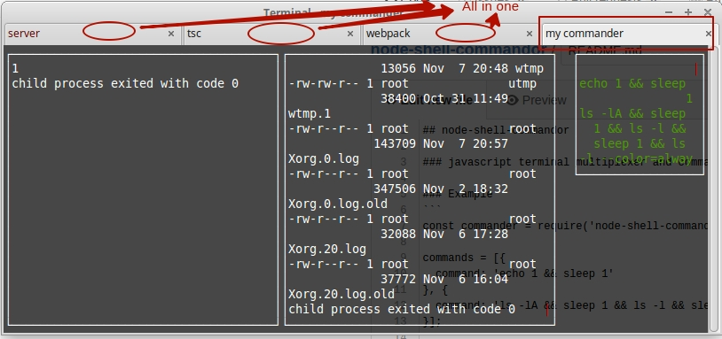
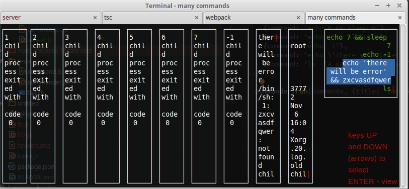
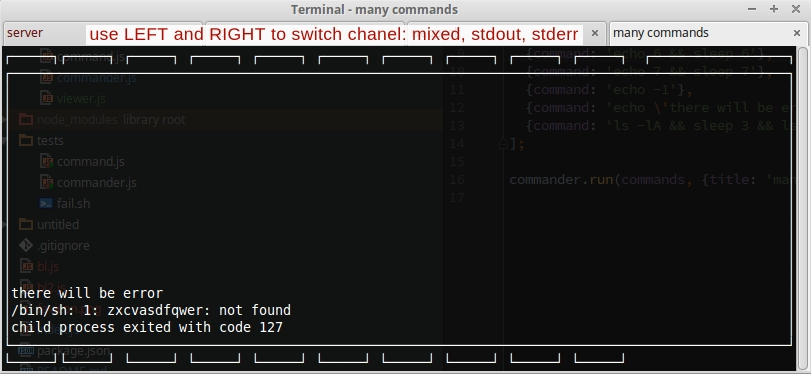

## node-shell-commandor

### javascript terminal multiplexer and command runner

### Example
```
const commander = require('node-shell-commandor');

commands = [{
  command: 'echo 1 && sleep 1'
}, {
  command: 'ls -lA && sleep 1 && ls -l && sleep 1 && ls -l --color=always /var/log/'
}];

commander.run(commands);
```


How to exit? *Ctrl+c* or *q*

How to see output of selected command? Use arrows (up/down then enter)



